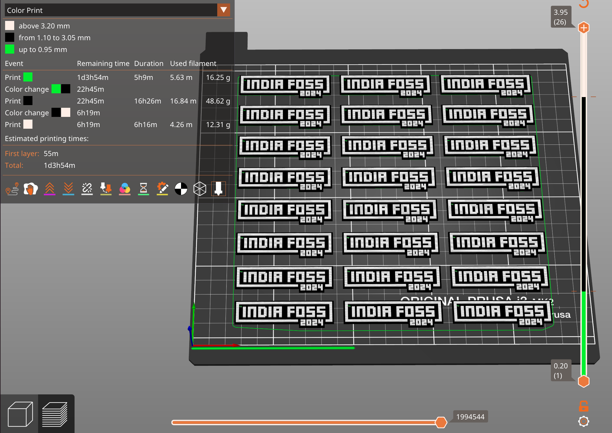

This is a 3D model of a keychain, modelled in the style of the IndiaFOSS 2024
conference logo.  IndiaFOSS is India's premier volunteer led open source
conference, organized by the FOSS United community.

# Why a new design ?

Every year brings in a new logo.  Thus, every year brings in a new design.
And the opportunity to experiment and have fun.

# Refreshed design

I picked up the IndiaFOSS 2024 logo and got to work. I had a good feeling about
the logo. It looked fresh. I directly mapped this to the front face - just 
follow the design. No brainer, really.

What about the back ? I typically design in something on the back side. This is
what prints in contact with the heated bed. The bed on my printer has some issues.
First layer is never as perfect as I need. The design carefully distracts
the casual (non-expert) observer from any imperfection of the print bed.

I settled on the _obvious_ "United By" tagline for the back. A test print with 
protruding text showed a lot of ugliness printing overhangs. I quickly
settled on emboss.

The logo lent itself to a good play of colors.  Three colors were used in
every keychain, with the following themes:
 1. Classic - light green, black and white
 2. India - Orange, Green and White
 3. Elegant - Pink, Purple and White
 4. Striking - Orange, Blue and White (Orange and Blue are complementary colors)
 5. Bengaluru - Yellow, Red and White

# Modelling

Inkscape was used. I found that the logo designer had actually stretched the
font to build the front text. Followed the same aspect ratio for the text on
the back - "UNITED BY".  2024 on the back is just a flipped mirror copy. All
the shapes are simplified. See keychain-elements.svg.

The SVG file is then imported into FreeCAD.  FreeCAD doesn't handle shapes
with holes correctly.  Boolean difference is used to manually fix letters with
holes - e.g. "O", "o", "B".  These shapes are extruded to build the final
model.  Thus, the SVG file decides the XY proportions. The model gets
its depth in FreeCAD. 

A specially modelled shape is used to reduce overhangs to the bare minimum.
See the freecad model for details.

After the model was finished, I realized it was too thick. This is a problem
both for people to keep in their pockets, as well as it takes a long time
to print.  Blender to the rescue.  Imported the STL, and used mesh editing
to reduce the thickness of the front and back faces to 1mm each.

The final STL is in indiafoss-2024-keychain.stl.

# The printing process

I carefully sliced the model with PrusaSlicer, to prepare the model for printing
on my Prusa i3 MK2. Used elephant foot compensation. Enabled ironing on all top
layers for a great finish.  A 0.25mm nozzle is used to ensure that fine text
prints fine. I use ColorFabb nGen, as it has worked great for me for many years.
Excellent prints and great colors. The model was scaled by 120% in XY, but Z
was unaltered. 3 mm thick keychains is good.

24 pieces of Classic were printed in one go. A 28 hour print. Settings are in
mc-indiafoss-2024-keychain.3mf

Here's the printing workflow:
 1. Initiate the print just before sleeping with the light green filament.
 2. Wake up in the morning, change to green.
 3. Change filament at the end of the day to white.
 4. Wake up to fresh cookies - oops, keychains!
